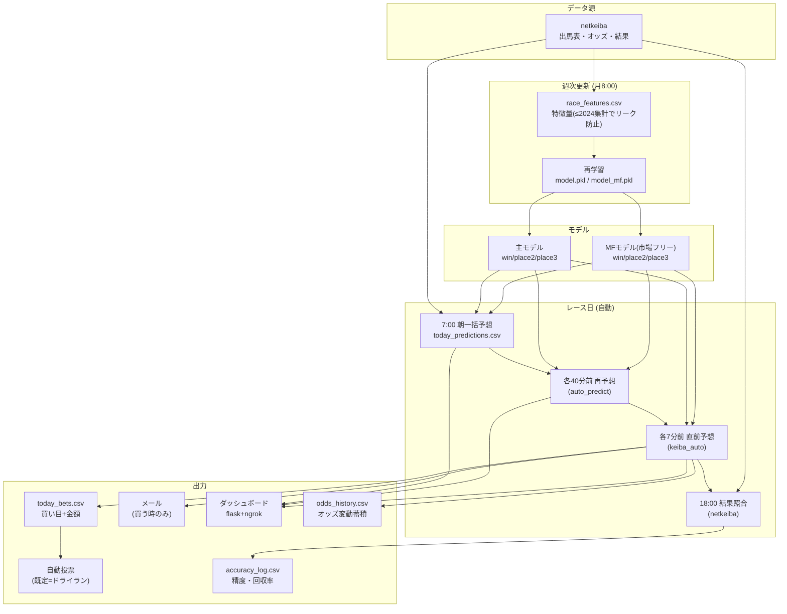

# 競馬AI システム仕様書

> **このファイルは仕様の正本です。予想ロジック・買い方・バックテスト結果を改定したら随時更新すること。**
> 最終更新: 2026-07-25

---

## 1. システム全体像

**主要プロセス（自動起動）**
| プロセス | 起動 | 役割 |
|---|---|---|
| auto_predict_publish | タスクスケジューラ 6:55 (デーモン) | 朝一括予想＋各40分前の再予想＋push |
| keiba_auto | 6:58起動〜21:00 | 各7分前に直前オッズで確定→買い目・メール・投票・記録 |
| 週次更新 | 月 8:00 | 特徴量再生成＋モデル再学習 |
| 結果照合 | 18:00 | netkeibaから結果取得→精度/回収率記録 |
| ダッシュボード | ログオン時(スタートアップ) | flask+ngrok・公開URLをメール配信 |

---

## 2. 予想仕様（印・妙の付与）

**モデル2本立て**
- **主モデル**: 通常の勝率/連対/複勝(place3)予測。市場(人気)情報も含む。
- **MFモデル(市場フリー)**: オッズ/人気を使わず予測。市場が見落とす価値馬の検出エンジン。

**印の付与**
| 印 | 定義 |
|---|---|
| ◎ 本命 | アダプティブ: 1番人気≤2.0倍 or OP以上 → 人気1位 / それ以外 → 主モデルplace3-1位(馬券内軸) |
| ○▲△ | 主モデルplace3(複勝確率)順の上位3頭(◎除く) |
| × 穴 | 人気薄(≥6番人気)で複勝妙味の高い1頭 |
| **妙(勝率妙)** | **MF勝率1位馬(◎と別馬のときのみ)** = 市場が過小評価する価値馬 |
| **複妙** | **MF複勝(place3)1位馬** = place系買い目の軸 |

**なぜ複妙軸か**: MFの複勝ランク1位馬は、勝率1位馬より馬券内率が高い(2025で50.0%→57.9%)。place系の軸・相手に使うと回収率が上がる。

---

## 3. 買い方仕様（判定マトリクス＋券種別）

**レース判定（妙の人気帯で決定）**
| 判定 | 条件 | 1レース予算 |
|---|---|---|
| 🔥 勝負 | 妙が7-9番人気 | 2,000円 |
| ✅ 買い | 妙が4-6番人気 × オッズ8倍以上 | 1,500円 |
| 🟢 堅実 | 妙なし(MFと市場が本命合意) × 1人気2倍超 × 非OP | 1,000円 |
| ⚠ 少額 | 下級×妙2-3番人気 | (閾値未満で購入対象外) |
| ❌ 見送り | 妙なし・妙10番人気以下・OP14頭以上 等 | 0 |

**券種ごとの軸と相手（重要）**
| 券種 | 軸 | 相手 | 根拠(2025実払戻BT) |
|---|---|---|---|
| 単勝 | 勝率妙 | — | 勝率軸150% > 複勝軸130% |
| 複勝 | **複妙** | — | 114→119% |
| ワイド | **複妙** | MF複勝上位(勝負帯) | 113→119% |
| 馬連 | 勝率妙 | **MF複勝上位5** | 140→**170%** |
| 馬単 | 勝率妙 | **MF複勝上位6**(勝負)/5(買い) | 221→**261%** |
| 3連複 | **複妙** | ◎+**MF複勝上位5** | 113→**131%** |
| 3連単 | 勝率妙 | **MF複勝**(2着上位3→3着上位5) | 152→**259%** |

> 核心: **place系の軸=複妙、連系の相手=MF複勝順位**。市場(人気)より良い相手を選べる。
> 例外: 勝負帯3連単マルチのみ相手=人気上位5(人気186% > MF153%)。堅実帯は主モデル○▲△を使用。

**予算配分（1レース内）**
- 1点の金額 = `KIND_STAKE[券種]` × `SIZE_WEIGHT[確信度]`（単勝500/複勝300/ワイド200/連系100・厚め1.6倍）
- 充当順は `ALLOC_PRIORITY` で切替:
  - **`balanced`(既定)**: メニュー順(単勝→複勝→…)で分散。予算内に収まるぶんを購入。
  - `ev`: 単勝を軸に確保→残りをBT回収率順。馬単/3連単に集中(高EV・高変動)。

---

## 4. バックテスト結果（予想仕様の裏付け）

### 4-1. 現行仕様の総合成績（予算配分込み・balanced）

| 期間 | 種別 | 回収率 | 収支(投資218万目安) | 判定 |
|---|---|---|---|---|
| **2025** | 調整年(honest OOS印/MF) | **198.5%** | +214万円 | パラメータ調整年 |
| **2024** | **完全OOS(リークフリー再学習)** | **164.6%** | +139万円 | **別年でも堅牢=本物** |

> 2024はモデルもリーク対策も≤2023で作り直した完全な未来検証。**全帯・全券種プラス**で崩れなかった。
> 34ptの差は「2025=調整年の有利＋≤2023モデルが2024に1年stale」による当然の割引。**実運用の現実的期待値は160%前後**。

### 4-2. 券種別 回収率（現行仕様・予算配分込み・balanced）

| 券種 | 2025 回収率 | 2025 収支 | 2024(OOS) 回収率 | 2024 収支 | 年またぎ |
|---|---:|---:|---:|---:|:--:|
| 単勝 | 192.8% | +76.1万 | 171.1% | +60.9万 | ◎両年プラス |
| 複勝 | 134.2% | +3.5万 | 109.1% | +1.0万 | ○両年プラス |
| ワイド | 140.6% | +6.8万 | 126.5% | +4.9万 | ◎両年プラス |
| 馬連 | 187.0% | +20.2万 | 126.9% | +4.8万 | ○両年プラス |
| 馬単 | 251.9% | +98.5万 | 187.7% | +55.3万 | ◎両年高水準 |
| 3連複 | 124.1% | +2.5万 | 129.2% | +2.8万 | ◎両年安定 |
| 3連単 | 165.6% | +6.4万 | 197.9% | +9.6万 | ◎両年高水準 |
| **全体** | **198.5%** | **+214万** | **164.6%** | **+139万** | — |

> **全券種が2025・2024ともプラス**。特に馬単(252%/188%)・単勝(193%/171%)・3連単(166%/198%)が主力。
> 複勝・3連複は回収率が低めだが的中の柱として保有（分散＝balancedの効果）。

### 4-3. 判定帯別 回収率（2025・balanced）

| 判定帯 | 回収率 | 購入割合 |
|---|---:|---:|
| 🔥 勝負 | 232% | 全レースの約10% |
| ✅ 買い | 239% | 約13% |
| 🟢 堅実 | 143% | 約28% |

### 4-4. 主要改善の効果（相手=人気→MF複勝順位）
乱数2分割で頑健性確認済み。ポートフォリオ全体(妙味帯) **167.9% → 207.1%**、買い目点数 **−20%**。
単体の券種ROI改善: 馬連 140→**170%** / 馬単 221→**261%** / 3連単 152→**259%** / 3連複 113→**131%**。

### 4-5. 確定した「効かない/やらない」検証（過剰適合の回避）
- 帯の5段階細分化 → 人気別ROIはノイズ(半分割で100-217ptブレ)。**据置**。
- 確信度で予算ブースト → SIZE_WEIGHTと冗長で効果ゼロ。**据置**。
- 堅実帯へのMF相手 → 主モデル○▲△(145%)が優位。**据置**。
- モデル精度自体 → 調教/絞込/対戦偏差/スピード指数など**全実験ゼロ=天井**。

---

## 5. 設定・トグル（keiba_predict.py / auto_vote.py 冒頭）

| 設定 | 既定 | 意味 |
|---|---|---|
| `ALLOC_PRIORITY` | `"balanced"` | 予算配分の性格。`"ev"`で高EV集中 |
| `RACE_BUDGET` | 勝負2000/買い1500/堅実1000 | 帯別1レース予算(円) |
| `KIND_STAKE` | 単勝500/複勝300/ワイド200/連系100 | 券種別1点額(円) |
| `BUY_INDEX_MIN` | 70 | 購入しきい値(指数未満は買わない) |
| `AUTO_VOTE_ENABLED` | `True` | 自動投票処理のON/OFF |
| `VOTE_MODE` | `"dryrun"` | `dryrun`=記録のみ / `ipat`=実投票(要ARMED＋認証＋SETUP_DONE) |

---

## 6. 蓄積中・今後（改定候補）
- **オッズ変動特徴**: `odds_history.csv`に朝/40分前/直前を蓄積中。数週間後に効果検証→有効なら特徴量化。
- **自動投票の実弾化**: IPAT購入フロー(`_submit_ipat`)を少額検証しながら確定→`SETUP_DONE=True`。
- 守り: 失敗アラート通知、netkeibaレート制限、model_mf.pkl軽量化。

---

## 改定履歴
| 日付 | 内容 |
|---|---|
| 2026-07-27 | MFモデルを分割保存/逐次読込化(mf_model_io)。2.5GB一括loadのピークRAMクラッシュ(7/26)対策。予測値不変。keiba_autoはレース有無確認をモデル読込より先に変更。 |
| 2026-07-26 | 結果報告の払戻照合キーに券種を追加(単勝06↔複勝06等の誤的中バグ修正)。ダッシュボードをローカルCSV直読み化(判定/買い目desync解消)。 |
| 2026-07-25 | 券種別回収率を2025/2024(OOS)両年で明記(全券種プラス)。判定帯別に購入割合を追加。 |
| 2026-07-25 | 初版。複妙軸・MF相手・予算配分・多年度検証(2024=164.6%)・自動投票(dryrun)・ダッシュボード自動起動まで反映 |
